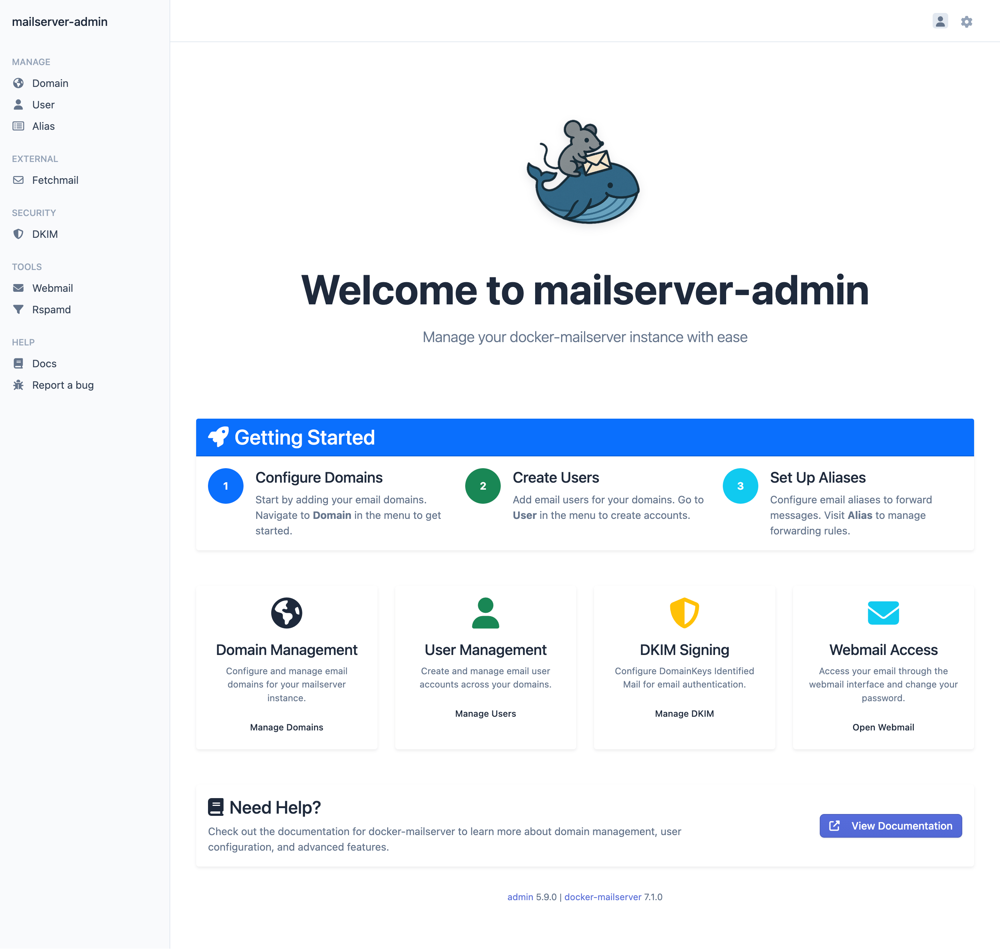
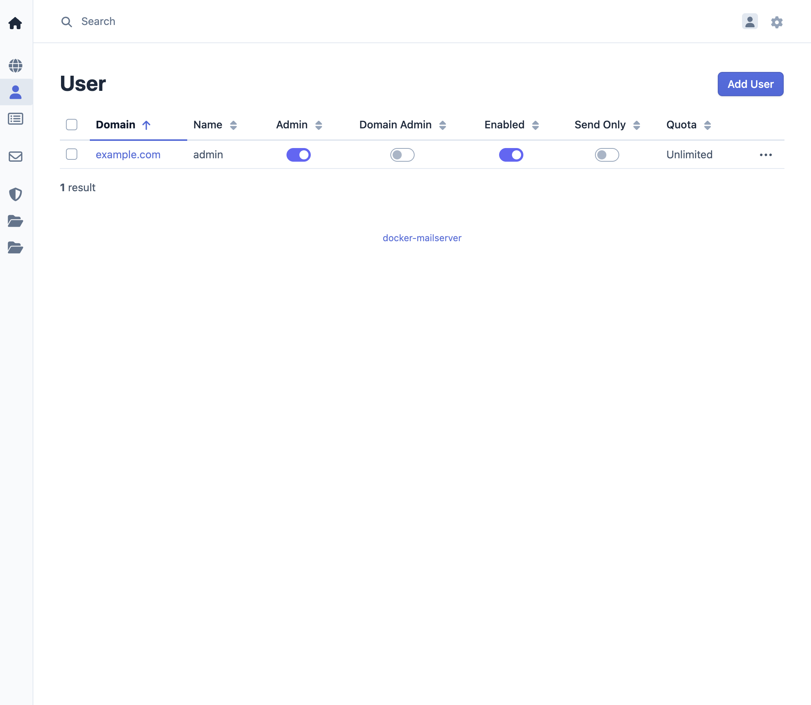
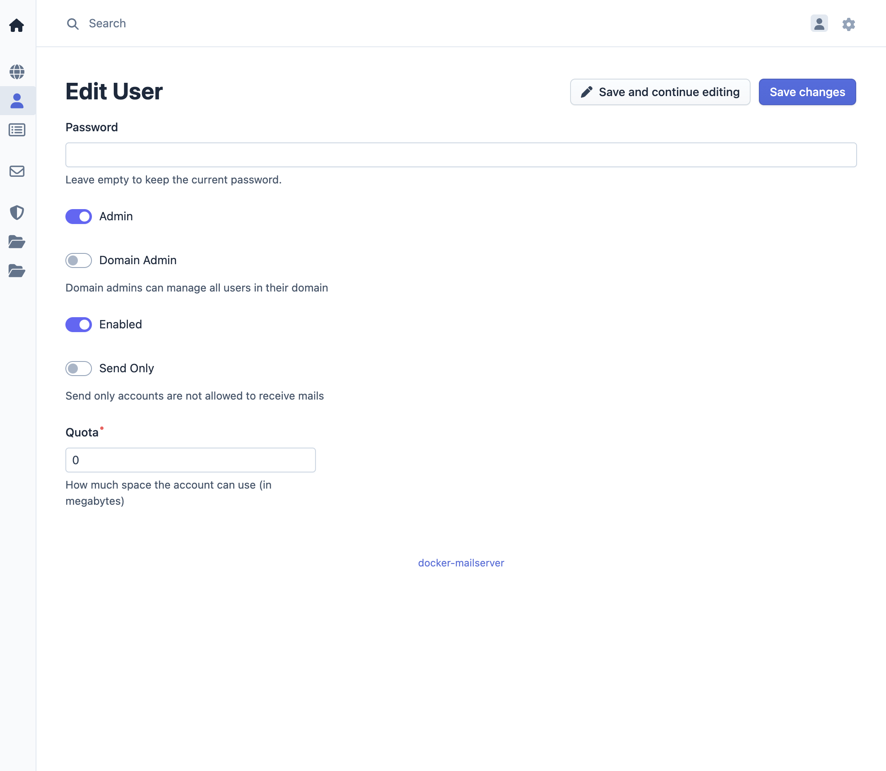
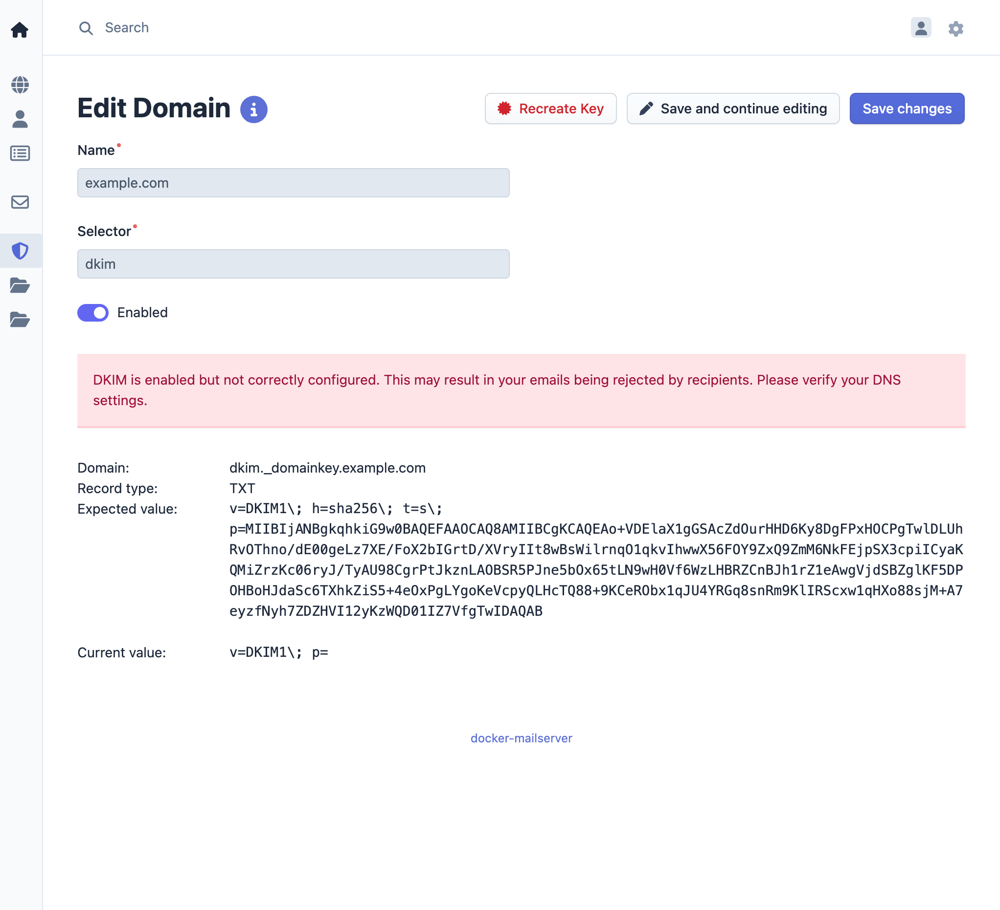
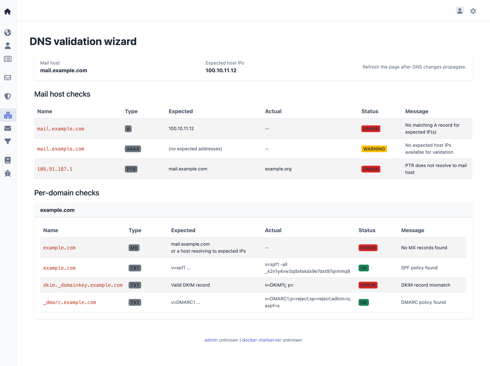

# docker-mailserver


`docker-mailserver` is inspired by the renowned [ISPMail guide](https://workaround.org/).
This project lets you run your own email services, giving you independence from large providers. It is a secure, customizable, and feature-rich solution for managing your email infrastructure.

Container images are built on [Alpine Linux](https://alpinelinux.org) or vendor base images and are kept lightweight.

[](https://github.com/jeboehm/docker-mailserver/actions/workflows/build.yml)
[](https://github.com/jeboehm/docker-mailserver/actions/workflows/test-yaml-schema.yml)
[](https://github.com/jeboehm/docker-mailserver/actions/workflows/release.yml)
[](https://github.com/jeboehm/docker-mailserver/actions/workflows/docs.yml)

## 📚 Documentation

**Full documentation is available at: [https://jeboehm.github.io/docker-mailserver/](https://jeboehm.github.io/docker-mailserver/)**

The documentation includes:

- Complete installation guides for Docker and Kubernetes
- Configuration reference for all environment variables
- Deployment examples and recipes
- Architecture and development guides

## Features

- Secure email protocols: POP3, IMAP, and SMTP with user authentication
- Web-based management interface for account, domain, and alias administration
- Integrated webmail interface
- DKIM message signing and spam filtering with Rspamd
- Real-time spam prevention using RBLs (Real-Time Blackhole Lists)
- Spam training by moving messages into and out of the Junk folder
- Fetchmail integration for external mail retrieval
- Quota management with notifications, catch-all addresses, and send-only accounts
- Local address extension (RFC 5233) for per-address sub-addressing
- Restriction of sender addresses for enhanced security
- Full-text search and enforced TLS
- DNS Validation Wizard for all mail related DNS records
- Generates configuration profiles for iOS and macOS devices
- Supports assisted client configuration in Outlook and Thunderbird
- Continuous health monitoring

See the [documentation](https://jeboehm.github.io/docker-mailserver/) for a complete feature list.

## Quick start

```bash
# 1. Clone the repository or download a release
git clone https://github.com/jeboehm/docker-mailserver.git
cd docker-mailserver

# 2. Copy and edit the environment file (set passwords for DB_PASSWORD,
#    REDIS_PASSWORD, CONTROLLER_PASSWORD, and DOVEADM_API_KEY)
cp .env.dist .env

# 3. Pull images and start services
bin/production.sh pull
bin/production.sh up -d --wait

# 4. Create the first email account and admin user
bin/production.sh run --rm web setup.sh
```

After setup, access the management interface at
`http://127.0.0.1:81/` and webmail at `http://127.0.0.1:81/webmail/`.

For a complete walkthrough, see the
[Getting Started tutorial](docs/tutorials/getting-started.md).

## Setup

`docker-mailserver` can be set up using Docker or Kubernetes.

For detailed installation instructions, see
[How to install with Docker Compose](docs/how-to/install-docker.md) or
[How to install on Kubernetes](docs/how-to/install-kubernetes.md).

## Screenshots

### Dashboard



### User management




### DKIM setup



### DNS Validation Wizard



## Links

- [Documentation](https://jeboehm.github.io/docker-mailserver/) - Complete documentation and guides
- [Development guide](docs/development/development.md) - Build, test, and contribute
- [Issues](https://github.com/jeboehm/docker-mailserver/issues) - Report bugs and request features
- [Releases](https://github.com/jeboehm/docker-mailserver/releases) - Release notes and changelog
- [License](LICENSE) - MIT
- Container Images:
  - [GitHub Container Registry](https://github.com/jeboehm?tab=packages&repo_name=docker-mailserver)
  - [Docker Hub](https://hub.docker.com/u/jeboehm?page=1&search=mailserver)
