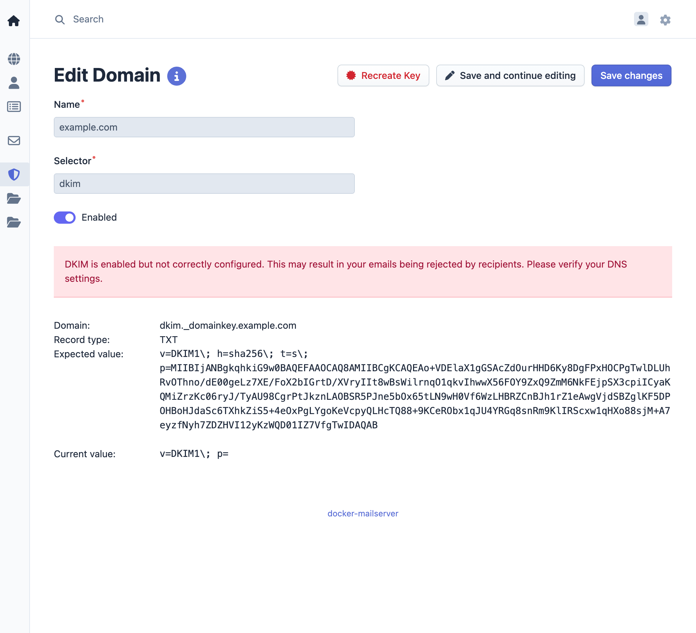

# DKIM Signing

DKIM (DomainKeys Identified Mail) signing provides cryptographic authentication for outgoing emails. This feature signs all outgoing emails from configured domains with a private key, allowing recipients to verify email authenticity through DNS records.

## Implementation details

DKIM signing is implemented using the Rspamd DKIM module. Each domain requires a separate DKIM key pair consisting of a private key (stored in docker-mailserver) and a public key (published in DNS).

Rspamd verifies the DNS record for each domain before signing outgoing messages. This ensures that only domains with valid DKIM DNS records will have their emails signed, preventing false signatures.

## Configuration steps

Configure DKIM through the management interface:

1. Access the management interface
2. Navigate to DKIM in the menu bar
3. Select the domain for DKIM configuration
4. Generate the private key
5. Add the provided DNS TXT record to your domain's DNS
6. Verify the DNS record through the management interface
7. Enable DKIM signing for the domain

## DNS Record

The management interface provides a DNS TXT record that must be added to your domain's DNS configuration. The record contains the public key used for DKIM verification by receiving mail servers.

## Operation

Once enabled, all outgoing emails from the configured domain are automatically signed with the DKIM private key. Receiving mail servers can verify the signature using the public key published in DNS, confirming the email's authenticity and integrity.
