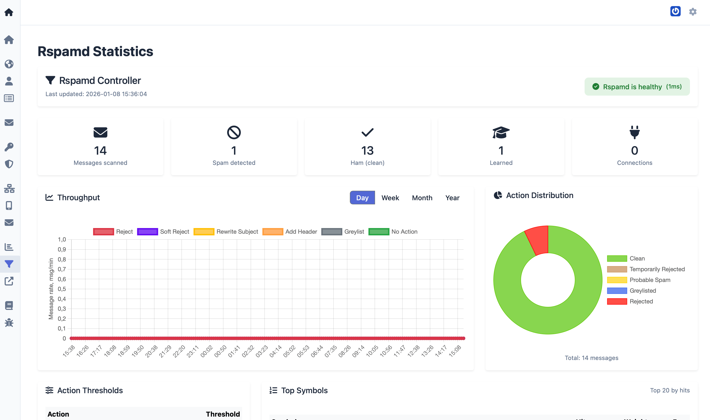

# About Observability

Observability is the ability to infer a system’s internal state from its external outputs. For a mailserver, that means using metrics and dashboards to see how mail and authentication are behaving without logging into each component.

mailserver-admin provides observability by aggregating data from the Rspamd filter and the Dovecot MDA and presenting it in web-based dashboards. This gives operators a single place to check service health, message throughput, spam filtering results, and authentication patterns.

## What the dashboards show

- **Rspamd Statistics:** Health of the Rspamd controller, message counts (scanned, spam, ham, etc.), throughput over time, action distribution (reject, greylist, clean, etc.), and configuration details such as thresholds and top symbols. This helps you see how much mail is being processed and how the filter is behaving.

- **Dovecot Statistics:** Connection to the Dovecot API (Doveadm HTTP), authentication successes and failures, index operations, authentication rate over time, and mail delivery rate over time. This helps you spot authentication issues or unusual delivery patterns.

Data is collected from consecutive samples; rates are computed as deltas between measurements. The dashboards support different time ranges (day, week, month, year) for throughput and rate charts.

## Why it matters

With observability you can:

- Confirm that Rspamd and Dovecot are reachable and responding.
- See whether message volume or filter actions have changed.
- Identify spikes in authentication failures that might indicate abuse or misconfiguration.
- Correlate delivery rates with changes in configuration or infrastructure.

For this to work, the web service must be able to reach the Rspamd controller and the Dovecot Doveadm HTTP API. The required environment variables (e.g. `MDA_DOVEADM_ADDRESS`, `DOVEADM_API_KEY`) are described in the [Upgrade changelog](../reference/upgrade-changelog.md) (v7.3) and [Environment variables reference](../reference/environment-variables.md).
Change at least `DOVEADM_API_KEY` from the default in production.

