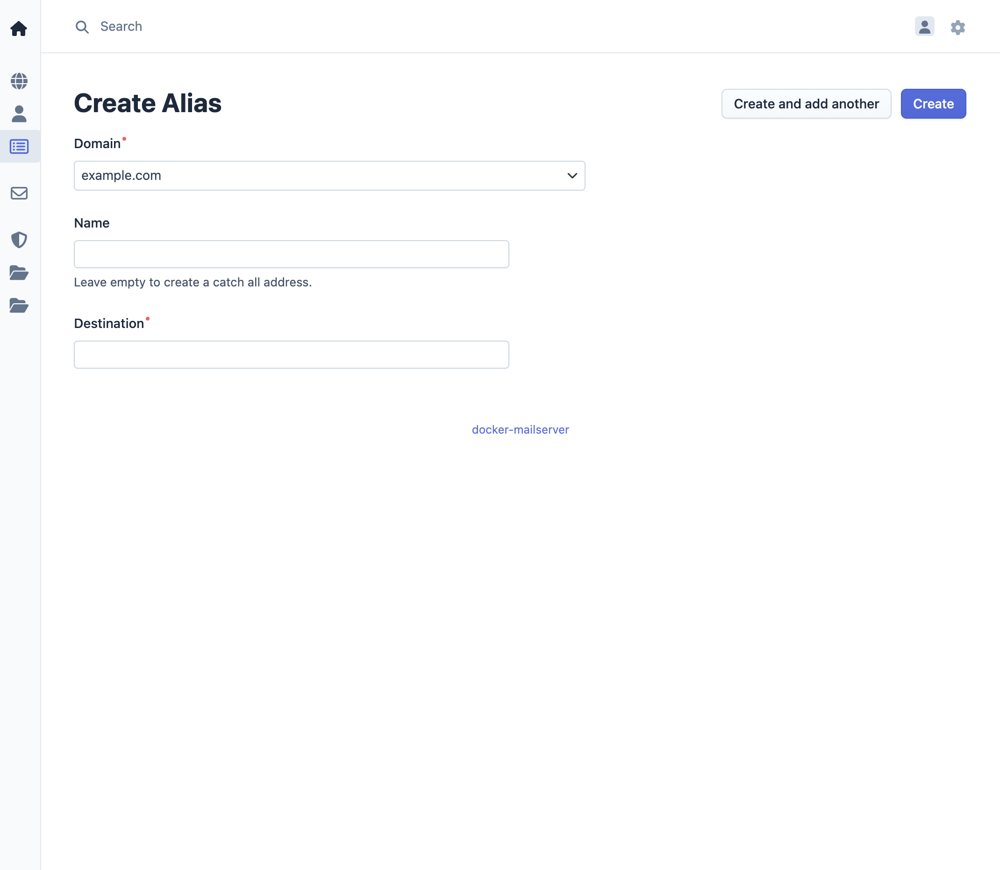

# Manage Aliases

Alias management allows administrators to configure email forwarding rules. Aliases forward incoming emails from one address to one or more destination addresses, which can be within the same domain or external addresses.

## Overview

Email aliases provide flexible email routing without requiring separate user accounts. Common use cases include:

- Forwarding emails to multiple recipients
- Creating generic addresses (e.g., `info@example.com`, `support@example.com`)
- Redirecting emails to external email providers
- Implementing catch-all functionality for specific patterns

## Access Control

- **Admin**: Can manage aliases across all domains
- **Domain Admin**: Can manage aliases within their assigned domain only
- **User**: Cannot manage aliases

## Alias Operations

### Adding an Alias

1. Access the management interface
2. Navigate to **Alias** in the menu bar
3. Click **Add Alias**
4. Enter the following information:
   - **Source Address**: The email address that will receive incoming emails and forward them to the configured destinations, formatted as a combination of local **name** part and **domain** part (e.g., `info@example.com`).
     You can leave the **name** part empty to create a catch-all alias address.
   - **Destination Address(es)**: An email address to forward emails to
5. Save the alias

The source address must belong to a domain that exists in the system. Destination addresses can be:

- Local users within the same domain
- Local users in other domains
- External email addresses

**Note**: The system allows multiple aliases with the same source address (name) if they have different destination addresses. To forward emails from the same source address to additional destinations, create separate alias entries specifying the same source address but a different destination address for each entry.

### Editing an Alias

1. Navigate to **Alias** in the menu bar
2. Select the alias to edit
3. Modify alias configuration:
   - **Source Address**: Change the receiving address
   - **Destination Address**: Update forwarding destination
4. Save changes

### Deleting an Alias

1. Navigate to **Alias** in the menu bar
2. Select the alias to delete
3. Confirm the deletion

**Note**: Deleting an alias only removes the forwarding rule. It does not affect any user accounts or email data.

## Alias Behavior

### Email Forwarding

When an email is sent to an alias address:

1. The mailserver receives the email
2. The alias configuration is checked
3. The email is forwarded to all configured destination addresses
4. When there is a local account with the receiving address, the email is delivered to the account mailbox.

### Multiple Destinations

When multiple destination addresses are configured, the email is forwarded to all addresses simultaneously. Each destination receives a complete copy of the original email.

## Use Cases

### Generic Addresses

Create aliases for common business functions:

- `info@example.com` → `team@example.com`
- `support@example.com` → `support1@example.com, support2@example.com`
- `sales@example.com` → `sales-team@example.com`

### Personal Aliases

Forward emails to personal accounts:

- `john.doe@example.com` → `john.doe@gmail.com`

### Distribution Lists

Forward to multiple recipients:

- `announcements@example.com` → `user1@example.com, user2@example.com, user3@example.com`
